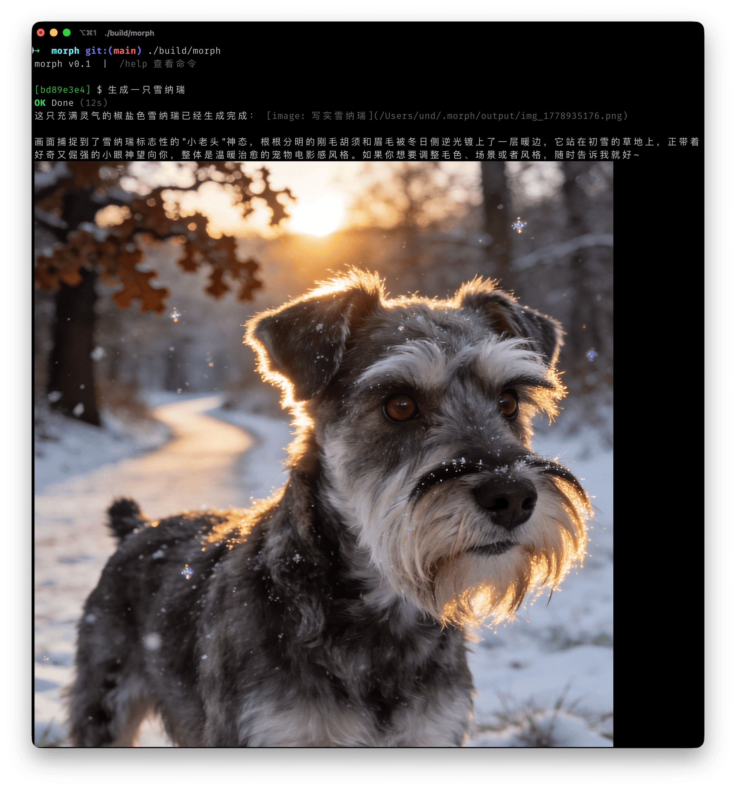

# morph



A terminal-native multimodal AI agent written in pure C. Orchestrates text, image, and video generation and understanding through a ReAct loop.

中文系统介绍: [docs/introduction.zh-CN.md](docs/introduction.zh-CN.md)

## Features

- **Multimodal in one place**: text chat, image generation/editing, and video generation under a single entry point
- **ReAct engine**: automatic Thought → Action → Observation orchestration
- **Skills**: hot-loadable instruction packs (SKILL.md) that inject specialized behavior into the agent
- **Extensions**: hot-pluggable extensions running in a sandbox, written in any language
- **Local-first**: sessions and artifacts persisted to SQLite, replayable offline
- **Lightweight**: minimal static dependencies, fast startup

## Build

Requirements: CMake ≥ 3.16, SQLite3, libcurl. Optional: readline., [mathjax-c](oxUnd/mathjax-c)

```bash
git clone https://github.com/oxUnd/mathjax-c vendor/mathjax-c
cmake -S . -B build
cmake --build build
```

Run tests:

```bash
cmake -S . -B build -DBUILD_TESTS=ON
cmake --build build
cd build && ctest --output-on-failure
```

## Configuration

Copy the example config and set your API key:

```bash
mkdir -p ~/.morph
cp config.toml.example ~/.morph/config.toml
export OPENAI_API_KEY=sk-...
```

Supported providers: `openai`, `volcengine`, `deepseek`.

## Usage

```bash
./build/morph
```

Optional flags:

- `-c <path>`: specify a config file
- `-s <name>`: specify a session name

## Extensions

Extensions are installed under `[ext].dir` from `config.toml`, which defaults to
`~/.morph/exts`.

Install from GitHub:

```bash
/ext install github:owner/repo
/ext install github:owner/repo@v1.2.0
/ext install github:owner/repo//exts/foo
/ext install github:owner/repo@v1.2.0//exts/foo
/ext install https://github.com/owner/repo/tree/main/exts/foo
```

The source format is `github:<owner>/<repo>[@ref][//subdir]`. `ref` may be a
tag, branch, or commit. Monorepo installs use `subdir` as the extension package
root. GitHub tree URLs are also accepted for the common
`https://github.com/<owner>/<repo>/tree/<ref>/<subdir>` form.

An extension package contains `manifest.toml` or `morph-ext.toml`:

```toml
name = "demo-native"
version = "0.1.0"
description = "Native demo extension"
type = "exec"
entry = "bin/demo-native"
fronts = ["cli"]
categories = ["dev"]

[build]
command = "make build"
```

`[build]` is optional. If present, morph asks before running the command unless
`--yes` is passed. After download or build, `entry` must exist inside the
package directory; no separate output list is configured.

## Layout

```
src/
  agent/    ReAct loop, context compression, tool dispatch
  agent/tools/
            Built-in tools (credits, memory, img_gen, vid_gen, ...)
  persistence/
            Persistent stores for memory and credit queries
  models/   LLM / image / video backends
  skill/    Skill discovery, parsing, and activation
  ext/      Ext loading and management
  sandbox/  Sandboxed ext execution
  ipc/      JSON-RPC
  render/   Markdown / image / video terminal rendering
exts/       Example exts (manifest.toml + entry script)
vendor/     Third-party libraries (cJSON, stb_image, toml)
```

See [AGENTS.md](AGENTS.md) for conventions and [REQUIREMENTS.md](docs/REQUIREMENTS.md) for the full spec.
