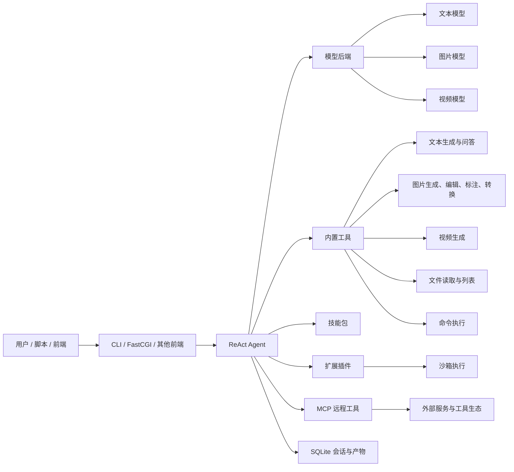
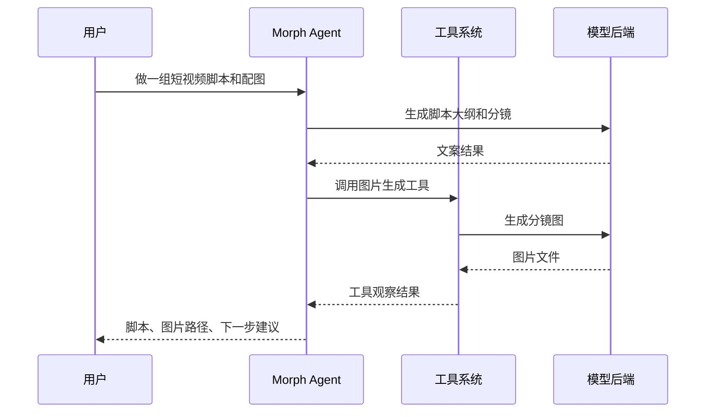
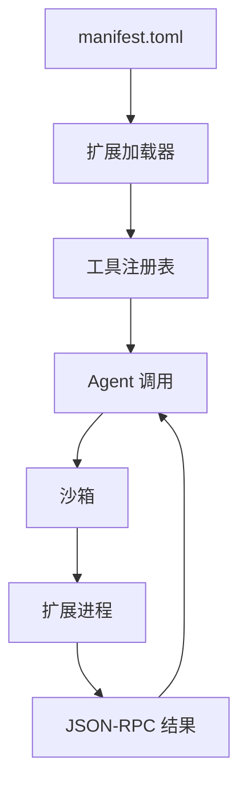
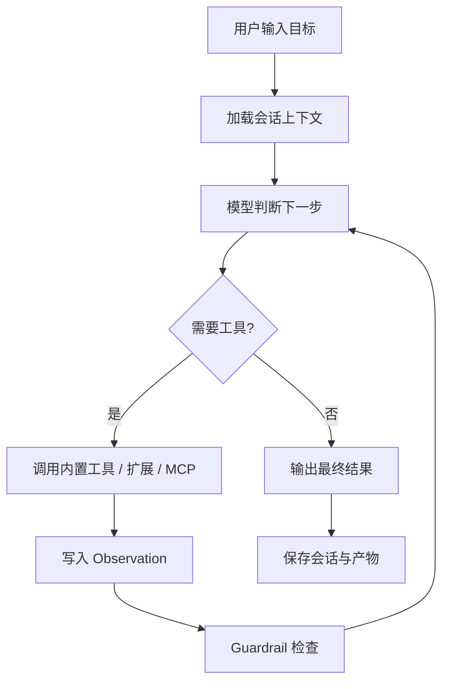
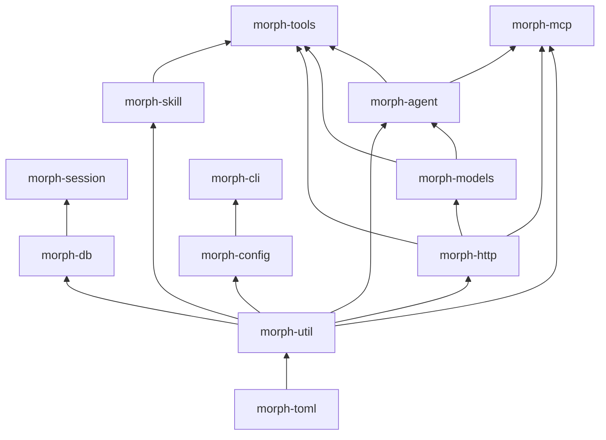

# Morph 系统介绍


Morph 是一套终端原生的多模态 AI Agent 系统，用纯 C 实现，面向文本、图片、视频和自动化工具调用场景。它把模型能力、工具系统、技能包、扩展插件和本地会话管理组合在一起，让用户可以用一条自然语言指令完成跨步骤、跨模态的任务。

它不是一个聊天壳，也不是单一模型的命令行封装。Morph 的核心是一套 ReAct 执行循环：系统会理解目标，选择工具，读取观察结果，继续规划，直到给出可交付的最终结果。

## 一句话定位

> Morph 是一个轻量、本地优先、可扩展的 CLI 多模态 Agent 运行时。

它适合三类人使用：

| 用户 | Morph 带来的价值 |
|------|------------------|
| 内容创作者 | 用对话完成选题、脚本、配图、视频素材生成 |
| 开发者 | 把 AI 能力接入 shell、CI、脚本和本地工具链 |
| 团队集成者 | 通过 MCP、扩展和 FastCGI 前端接入现有系统 |

## 系统全景



Morph 的设计重点是把复杂能力收束到统一入口里。用户只需要描述目标，系统负责把任务拆解到合适的模型、工具或扩展上。

## 核心能力

### 多模态统一入口

Morph 内置三类模型后端：

- `llm`：文本对话、写作、推理、结构化输出
- `image_gen`：图片生成、图片编辑、图片理解相关任务
- `video_gen`：文本或图片驱动的视频生成

这三类后端可以独立配置，使用不同 provider、模型和 API key。对用户来说，它们仍然是同一个 Agent 的能力。



### ReAct 自动编排

Morph 的执行循环遵循：

```text
Thought -> Action -> Observation -> Guardrail -> Final
```

这意味着它会在任务过程中持续判断：

- 当前目标是否已经完成
- 是否需要调用工具
- 工具结果是否可靠
- 是否要继续追问、修正或收敛

相比只做一次模型调用，ReAct 更适合处理“先读文件、再分析、再生成、再保存结果”这类真实工作流。

### 技能包

技能包是热加载的指令集，通常是一个 `SKILL.md` 文件。它可以把某类任务的流程、约束、术语和工具使用方式打包起来。

适合做成技能包的场景包括：

- 固定领域写作流程
- 专项数据分析规范
- 企业内部工具使用手册
- 多步骤业务 SOP

技能包让 Morph 不需要把所有知识写死在代码里，也方便团队按需扩展。

### 扩展插件

扩展插件安装在本地扩展目录中，可以用任意语言编写，通过 manifest 声明入口、权限和参数结构。Morph 负责发现、加载和调用扩展。



这种机制适合把本地脚本、团队工具、私有 API 或实验能力接入 Agent，同时尽量降低对主进程的影响。

### MCP 集成

Morph 支持 Model Context Protocol，可以通过 stdio 或 Streamable HTTP 连接远程 MCP server，并自动发现工具、资源和提示词。

MCP 的价值在于把外部系统能力标准化。Morph 不需要为每个服务写一套专用集成，只要对方暴露 MCP 接口，就可以进入统一工具系统。

### 本地优先

Morph 使用 SQLite 保存会话和相关状态，生成产物默认写入本地输出目录。这样带来几个直接好处：

- 历史会话可以回放和追踪
- 生成文件留在本机，方便二次处理
- CLI、脚本和自动化流水线可以稳定引用结果路径
- 网络只用于必要的模型或远程工具调用

## 一次任务如何运行



用户看到的是一句自然语言指令和最终结果。系统内部实际完成了上下文组织、工具选择、结果观察、安全检查和状态持久化。

## 适用场景

### 内容生产

Morph 可以把创作链路串起来：

1. 生成选题和标题
2. 写文章、脚本或分镜
3. 生成配图或视觉参考
4. 继续生成短视频素材
5. 保存本地文件，供剪辑或发布使用

### 开发者自动化

开发者可以把 Morph 放进命令行工作流中，用它处理代码解释、文件分析、文档生成、工具调用和批量任务。

### 企业内部 Agent

团队可以通过技能包固化业务流程，通过扩展插件接入内部系统，通过 MCP 连接标准化工具生态。Morph 只负责运行时和编排层，不强行绑定某个业务域。

## 技术特点

| 维度 | 说明 |
|------|------|
| 实现语言 | 纯 C，核心依赖少，启动快 |
| 架构方式 | 静态库分层，CLI 主程序组合各模块 |
| 模型接入 | 文本、图片、视频后端独立配置 |
| 工具系统 | 内置工具、扩展插件、MCP 工具统一注册 |
| 会话存储 | SQLite 本地持久化 |
| 渲染能力 | Markdown、图片、视频在终端侧呈现 |
| 扩展隔离 | 扩展通过子进程和沙箱机制运行 |
| 上下文管理 | 支持 token 估算、压缩和会话历史管理 |

## 模块结构



这套分层让系统既能保持 C 项目的可控性，也能把模型、工具、技能、MCP、前端渲染等能力拆成清晰边界。

## 和普通 AI CLI 的区别

| 普通 AI CLI | Morph |
|-------------|-------|
| 多数只包装一次模型调用 | 内置 ReAct 循环，可多步执行 |
| 通常偏文本能力 | 文本、图片、视频统一编排 |
| 插件能力弱或不可控 | 支持技能包、扩展插件、MCP |
| 会话和产物常不稳定 | SQLite 本地持久化 |
| 难接入私有流程 | 技能包和扩展适合团队定制 |

## 快速开始

构建：

```bash
cmake -S . -B build
cmake --build build
```

准备配置：

```bash
mkdir -p ~/.morph
cp config.toml.example ~/.morph/config.toml
export OPENAI_API_KEY=sk-...
```

运行：

```bash
./build/morph
```

## 适合向别人介绍时这样说

Morph 是一个用 C 写的多模态 Agent 运行时。它把大模型、图片和视频生成、内置工具、插件、技能包和 MCP 远程工具统一到一个终端入口里。用户用自然语言描述目标，系统通过 ReAct 循环自动拆解任务、调用工具、观察结果并给出最终产物。

它的特点是轻、本地优先、可扩展，适合内容生产、开发者自动化和团队内部 Agent 集成。
